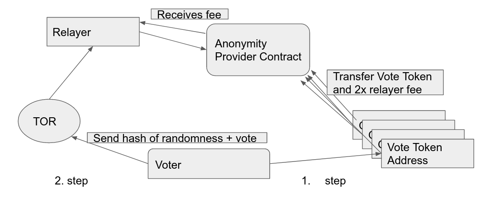
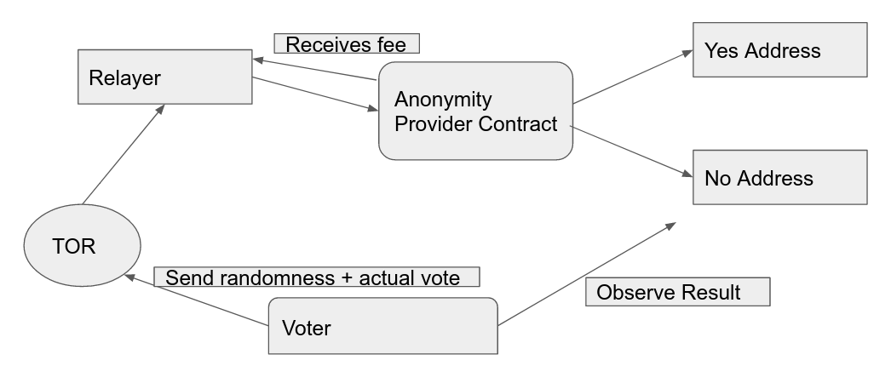

# Tornado Vote (Private Voting based on tornado Cash)

This repository contains a private vote protocol, developed for my Masterthesis. The voting protocol is an extension of the privacy protocol **[tornado cash](https://github.com/tornadocash/tornado-core)** and an ERC20 token of the **[Open Zeppelin Library v2.4](https://github.com/OpenZeppelin/openzeppelin-contracts/tree/release-v2.4.0)**. I am not associated with the team behind tornado cash.

Tornado Cash is a noncustodial mixer which takes in tokens and a commitment, a hash. These commitments are added to a merkle tree. Using a zero knowledge proof a relayer can withdraw funds to a new address therefore unlinking the original address and the new address achieving certain anonymity.

The voting protocol uses the anonymity of tornado cash to transfer extended ERC20 vote tokens to addresses specified at deployment which represent choices for example yes or no.

**The voting protocol is composed of three phases:**

**Registration Phase**: The administrator deploys the smart contracts and sets the parameters (initial Supply, address yes,address no,block endphase1,block endphase2,block endblockelection, address tornado_contract) and distributes the tokens to eligible voters. After distribution the administrator must retain one or zero vote tokens.

**Commitment Phase**: Transfer token to anonymity provider and retain note. Subsequently, the voter uses the note to submit the first 20 bytes of a sha3 hash H(32 bytes randomness || 1 byte Vote) via a relayer to the anonymity provider which saves the hash in the vote token. This hash is a commitment for the vote to be cast next round to ensure fairness.

**Voting Phase**: The voter submits the inputs for the prior hash commitment in clear text over a relayer to the anonymity provider. The anonymity provider calls the vote token and with the given inputs which checks for the existence of a the first 20 bytes of a sha3 hash corresponding to the inputs. If a corresponding hash is found, it is deleted, and a vote is transferred to the choice given in the last byte of the input for the hash commitment.

**Protocol Properties:**
- self tallying
- vote privacy
- publicly verifiable with ethereum blockexplorer
- fairness
- no single point of failure after registration phase

## Security

Both the original tornado cash protocol and open zeppelin ERC20 token implementation have been audited and are deployed on the Ethereum mainnet today. Of the tornado cash code the withdraw function has been renamed commit and additional input and a function call to
Since, the code has been modified, in particular the ERC20 token, a new security analysis was conducted using the tools, **[Slither]()**, **[Mythril]()** and **[VeriSol](https://github.com/microsoft/verisol)**. With VeriSol a number of safety properties have been formally verified, for details check the **[VeriSol directory](https://github.com/ananas-block/tornado-vote/tree/master/VeriSol)**.

**Nevertheless, this is still experimental software use at your own risk!**

## Deploy

### Test
`nvm use v11.15.0`

`npm run install`

`npm run build:self`
(this step will take a while)

`ganache-cli --mnemonic "sock work police cube fine clean early much picture scan foot sure" –networkId 1337`

`npm test ./test/VoteToken.test.js`

### Deploy locally
`nvm use v11.15.0`

`npm build:self`

`ganache-cli --mnemonic "sock work police cube fine clean early much picture scan foot sure" –networkId 1337`

`npm run migrate:dev`

`./cli.js test_ganache`

### Deploy on testnet

Edit .env file for election configuration

`npx truffle migrate --network kovan --reset`

configure .env file with path to file with election participants

register participants in participants.txt file and retain one token
`./cli.js register_testnet`

`./cli.js deposit vote 1 -r <rpc-url>`

`./cli.js commit <your-note> -Vote yes -r <rpc-url>`

